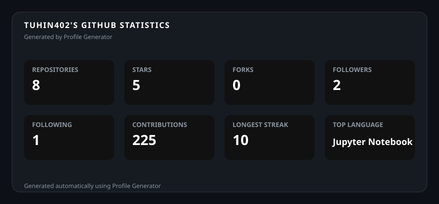
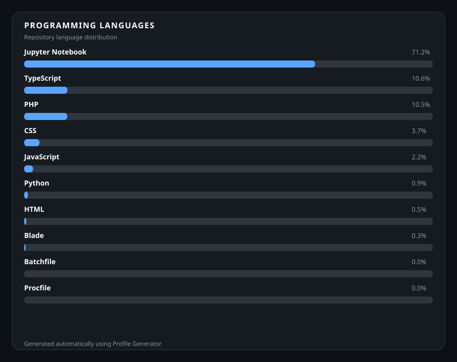
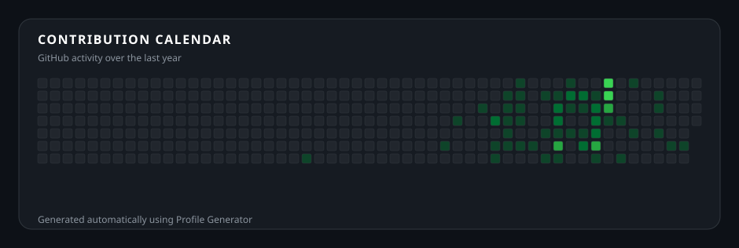
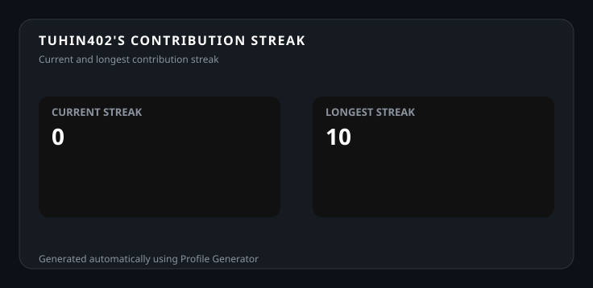

<h1>Tuhin</h1>

<strong>Full Stack Web Developer</strong>

Building polished web experiences, developer tooling, and practical systems with a focus on clean architecture and thoughtful UI.

## ⚡ Skill Arsenal

⚔️ Building with a full-stack toolkit — one release at a time.

## 🎮 GitHub Arena

## 🧬 Code DNA

## 🌱 Activity Garden

## 🔥 Streak

Generated by a custom Python + SVG profile pipeline.

